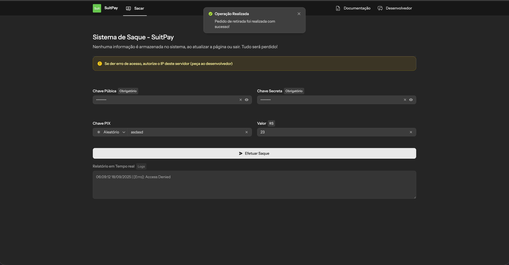

# Sistema de Saque Simples - SuitPay

Uma plataforma simples para realizar **saques via SuitPay**.  
O usuário apenas insere suas **chaves de API**, **tipo de chave PIX** e o **valor**, e o sistema envia a requisição diretamente para a SuitPay.

⚠️ **Nenhuma informação é armazenada no sistema (não tem banco de dados).**  
Ao atualizar a página ou sair, todos os dados são perdidos!

---

## 📌 Funcionalidades

- Inserção de **Chave Pública** e **Chave Secreta** da SuitPay
- Definição do **tipo de chave PIX** (Aleatória, CPF, CNPJ, E-mail, Telefone)
- Escolha do **valor** para saque em Reais (R$)
- Envio do **pedido de saque** para a SuitPay
- Exibição de **relatório em tempo real** com os **logs da requisição**

---

## 🚀 Como usar

1. Obtenha suas **chaves de API** no painel da SuitPay.
2. Configure o **tipo de chave PIX** e o **valor desejado**.
3. Clique em **Efetuar Saque**.
4. Acompanhe o **relatório em tempo real** com o status da operação.

---

## ⚠️ Observações Importantes

- Caso ocorra **erro de acesso**, pode ser necessário **autorizar o IP do servidor**.  
  → Solicite ao desenvolvedor a inclusão do IP na sua conta SuitPay.

- **Nenhum dado é persistido** no banco ou no servidor.  
  → O sistema é **100% temporário e seguro**.

